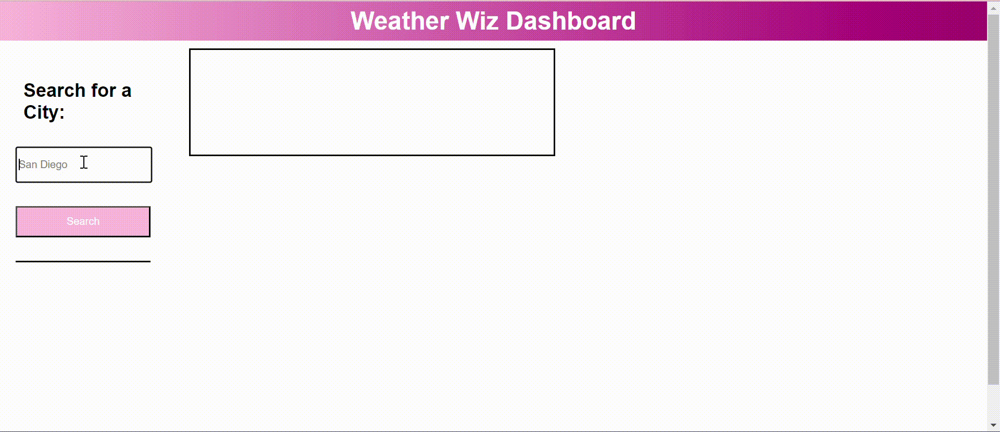

# Weather Wiz

## Description
For travelers starting a new adventure, Weather Wiz a must-have travel essential. Weather Wiz provides detailed weather forecasts for different cities, and helps travellers confidently plan their trips today, tomorrow and even an entire week ahead. While traveling requires a variety of handy mobile applications, travelers can come back to Weather Wiz any time to check for updates on their previously searched cities.

## Table of contents
- [Installation](#installation)
- [Screenshot](#screenshot)
- [Features](#features)
- [Usage](#usage)
- [credits](#credits)
- [License](#license)
- [Contributing](#contributing)

## Installation
To install this project git clone https://github.com/AliahG97/weather-wiz.git

## Screenshot

## Features

1. Multi-City Forecast: Access current and future weather conditions for multiple cities providing the user with holistic view to plan their journey effectively.

2. Search History: Users can easily track their previous searches allowing quick access to latest weather updates for their favorite destinations. 

3. Detailed Weather Information:To ensure users have all the information they need at their fingertips, there are in-depth details for each city including the city name, date, icon representation of weather conditions, temperature, humidity and wind speed. 

4. 5-Day Forecast: Users an plan their itinerary with a 5-day forecast that showcases the date, weather icons, temperature, wind speed and humidity helping the user make informed decisions for the upcoming week. 

5. User-Friendly Dashboard: Weather Wiz is easy on the eyes with an intuitive dashboard which includes form inputs, which makes navigating through the app simple and easy.

## Usage
This app is ideal for travelers going from a variety of different cities and locations in a short period of time. It is also ideal for regular daily use by people who are not travelling and simply going to work or planning events and activites that may be impacted by the weather. Whether we like it or not, weather is always something to factor in; Meaning, Weather Wiz is for any and everyone.

## Credits
Aliah Guerra (https://github.com/AliahG97)

## License
Creative Commons License
by Aliah Guerra2024. Confidential and Proprietary. All Rights Reserved.

## Contributing
- Minor styling and aethetics enhancements would be a great additon to the app given more time. 
- More specific city name to be displayed including the country or state/province in order for the user to ensure they have searched up the right city in the event that the user searches cities that share the same name.
- Edit the code so that duplicates of the same city wouldnt be saved as a new button in the history (stored locally).

